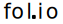

<h1></h1>

## Overview

**fol.io** is a platform where anyone can join and contribute to forums over any topic. As a user, you can simply scroll through other users' posts or post, comment, and reply to bring light to new ideas. If you enjoy content a user shares, you have the ability to upvote them. Users with highest amount of votes will be displayed on the front page. The voting system also applies for forum posts. However, comments use a liking system. Liking one's comment does not do anything special accept increase a virtual number (but people appreciate it when you like their comments). When another user replies to one of your comments, comments on your profile/post, or modifies your rank in a forum, you will receive a notification in your fol.io inbox.

## Revival Notes

The original project was developed in 2019-2020. The revival was done in 2024. The revival was done for fun and to see how much I have improved since the original project.

The revival stays true to the original with code mofified only to make it work in 2024. Even the above overview is the same... which is why you will find spelling and grammatical errors.

The revival was done in Docker to make it easier to run the project on any machine. Features like email verification have been removed. All verification codes are hardcoded to be `69420`.

## Reflection

The code in this project was written by me in highschool and it certainly shows. The code is not the best and I would not recommend using it as a reference. Infact, its a miracle it works at all. However, I am proud of the project as it was one of my first full-stack projects. I learned a lot from this project and I am happy to have it in my portfolio.

## Languages/Tools Used

- Server
  - PHP 7.3
  - SQL
  - SendGrid (removed for revival)
  - Docker (for revival)
- Client
  - HTML
  - CSS
  - JavaScript

## Images

Below are some images of the project. They do not show every minor part of the project, but they do show the main parts.

 

  Developed by <b>Connell Reffo</b> in <b>2019-2020</b> and revived in <b>2024</b>.

